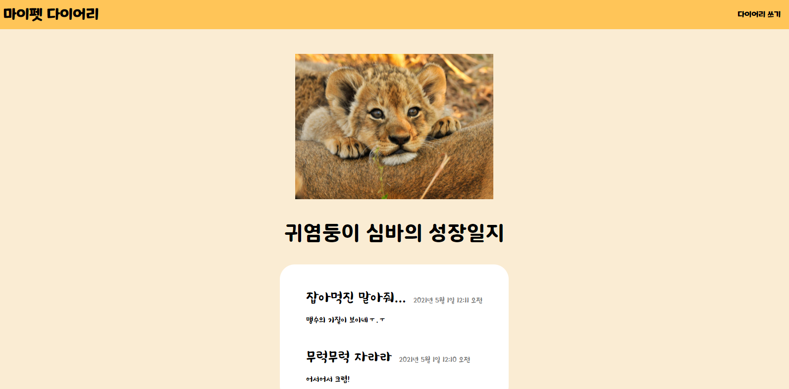
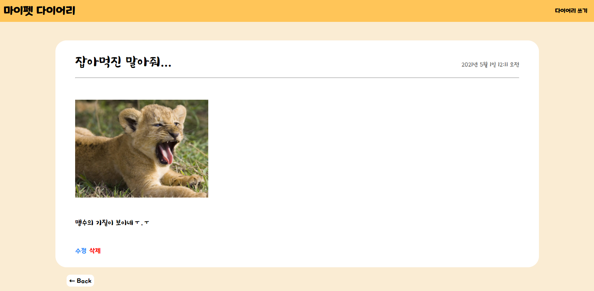
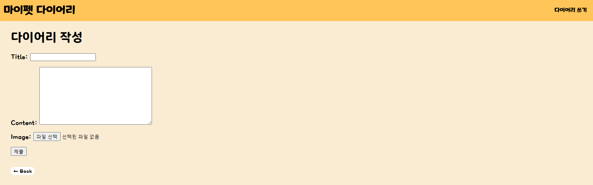
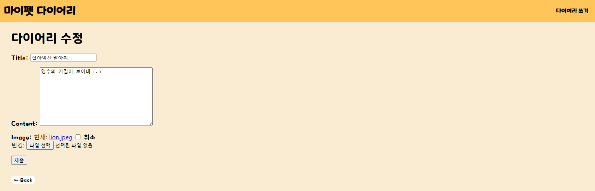

# 낭떠러지 미션 예시 프로젝트

### 1. 프로젝트 실행 화면

- **웹페이지 홈 화면**

  

   

- **게시글 상세 화면**

  

   

- **게시글 작성 화면**

  

   

- **게시글 수정 화면**

  

 

### 2. 프로젝트 설명

"2021 서강대 멋쟁이 사자처럼 온라인 복커톤"의 첫 번째 미션인, 낭떠러지 미션의 예시 프로젝트입니다! 

 

낭떠러지 미션은 **낭떠러지에 밀어넣고 스스로 빠져나오게 한다**는 발상에서 만들어진 미션으로, 멋사의 아기사자들이 스스로 웹페이지를 구현하는 기회를 마련하고자 만들어졌습니다! 

 

3~4월 세션의 주요 내용인 CRUD와 CSS를 활용하면 예시 프로젝트를 충분히 구현할 수 있습니다. 언뜻 보면 Bootstrap을 활용한 것 같지만, **웹 페이지 디자인은 Bootstrap과 같은 부가적인 프레임워크 없이 순수하게 CSS로만 이루어졌습니다.**  그렇기에 비효율적인 코드 중복이 많다는 문제점이 있긴 합니다.

 

이와 같이 예시 프로젝트를 만든 이유는 두 가지가 있습니다.

1. 아직 아기사자 분들이 템플릿 공유와 Bootstrap을 배우지 않았기 때문입니다.
2. 위 예시를 순수한 HTML과 CSS로만 짜다보면 필연적으로 같은 코드를 계속 쓰게 됩니다. 이 경험을 통해 다음 세션 내용인 Bootstrap의 필요성을 직접 느끼게 하기 위함입니다.

 

코드를 참고하실 분들은 클론을 받으셔서 확인해주시고, 혹시 문제가 있다면 피드백도 주세요!

